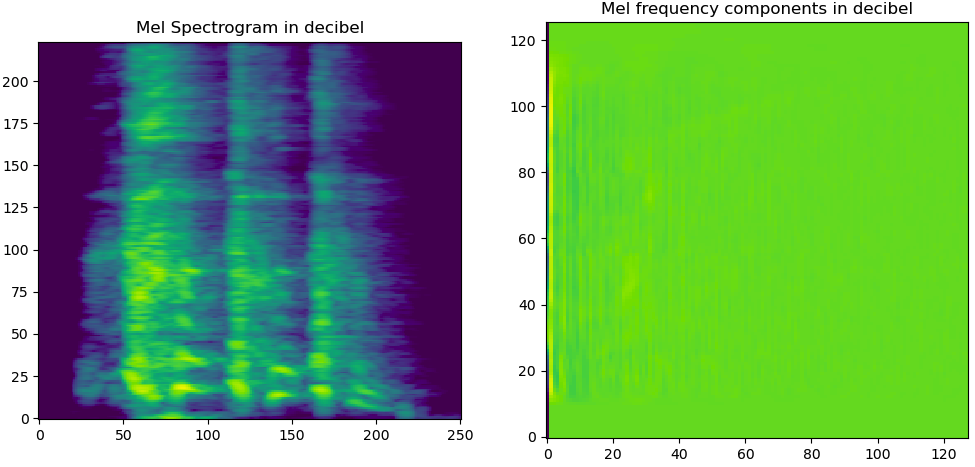
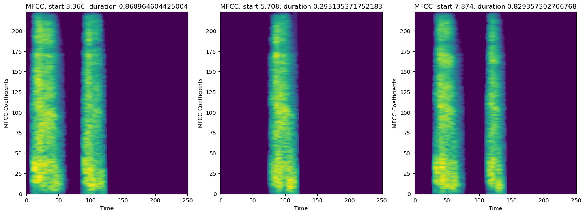

# Vocal Sound Modelling - Cough Detection

In this project, we are tackling the problem of cough detection. This report details the solution and is split into three parts:

1. Data analysis and preprocessing
2. Vocal sound modelling
3. Result and further considerations

## 1. Data analysis and preprocessing

### 1.1 First principles

We have a dataset that represents four vocal sound categories:

- Cough
- Laughter
- Mic Tapping
- Crowd talking

We observe that the audio clips have varying lengths, ranging from a few seconds up to more than two minutes. To prepare the data for modelling purposes, as well as, for the purpose of better capturing temporally local features, we segment the audio clips into **equally sized chunks of preselected duration**, hereafter denoted as  $d$. This serves a dual purpose.

- Our solution resembles a realistic scenario where the classification takes place in **near-real time**, for latency-critical applications.
- We normalize the input data to so that our input samples represent a similar amount of information.
  
An added benefit is that for longer clips, we may generate several samples. For instance, the `Crowd Talking` category contains only five audio clips, with long durations. Segmentation allows to increase the number of samples in this class.

### 1.2 Data augmentation

To improve the robustness and generalization of a model, one can employ various audio data augmentation techniques. Some methods, that can be used, are frequency masking, noise addition and, of course, public datasets:

1. Open dataset usage: Audio classification is a popular topic and there are several open-source datasets that can be used to augment the data. In fact, we have added some audio clips to the `laughing` category from the [VocalSound](https://github.com/YuanGongND/vocalsound) dataset, which contains samples from different categories, including `coughing` and `laughter`.

2. Noise Addition: This method involves adding random noise to the audio signal. By introducing controlled amounts of noise, we can help the model learn to distinguish between relevant audio features and background noise. This is especially important for real-world applications where clean audio signals are rare. This is already part of the dataset, in particular, the audio clips in the folders `mix{k}_cough_train` where k=1,2,3 or 4 contain background noise.

3. Frequency Masking: This technique involves masking out a range of frequencies in the spectrogram representation of the audio.

**Note**: The folder `101846__stereodivo__vox_squad_laughing` was removed from the data because it needed special treatment.

### 1.3 Data Segmentation

We have observed that `cough` audio clips, multiplex cough sounds with silence. However, we know the segments of the clip, containing the sounds (provided in accompanying files called `label.label`). We use these annotated segments of length $$n \triangleq d \times sr$$, where $$d$$ is duration in seconds and $$sr$$ is the sample rate. We have two cases:

- The $k$-th annotated segment duration $d_k$ exceeds the max chunk duration, i.e., $d_k \geq d$. In this case, we simply keep the first `n` samples, and discard the remaining ones.
- The $k$-th annotated segment duration $d_k$ is less than max chunk duration, i.e., $d_k < d$. In this case, we pad the segment, on both ends, with zeros (silence). In particular, we **randomly** split the total silence time $d-d_k$ into two parts, which are used to pad the clip from the left and the right ends.

In our experiment, we chose $d=2$ seconds, by inspecting the histogram of `cough` durations, shown below. We find out that approximately $2$ seconds, shown as the black vertical line, correspond to the `97.5-th percentile of all cough duration` and thereby represents the majority of our data distribution. Hence, we chose the chunk duration to be $d=2$ seconds.

For other, non-cough, of the audio clips, we simply segment in chunks of length $d$, as illustrated in the figure below.

## 2. Vocal sound modelling

## 2.1 Preparing data for audio classification

Sounds is a sequential signal, but it can be transformed into an image, which enables us to use computer vision techniques, like [Convolutional Neural Networks](https://en.wikipedia.org/wiki/Convolutional_neural_network), which have the added advantage that their implementation can be parallelized. Two ways to extract arrays from a sound signal are the [Mel Spectrogram](https://en.wikipedia.org/wiki/Spectrogram) and the [Mel Frequency Cepstral Coefficients](https://en.wikipedia.org/wiki/Mel-frequency_cepstrum). Below, we see how these two spectral representation look like for coughing for coughing:

In this modelling task, we will experiment with both spectral representations, to create a model for vocal sound classification.

## 2.2 Train-test split

It is a standard practice to split a dataset into two or three parts, namely `train`, `validation` and some times `test`. The most common way of splitting the data is to take to randomly assign samples to train and validation dataset, in a stratified manner to maintain the balance of the classes. However, we claim that this process is **not suitable** for our dataset.

We have chosen to split the data for train and validation by assigning **entire clips in each group**. Hence, all the underlying chunks of the same clip will belong to either the `train` or the `validation` datset. The reason for this is simple; if we randomly split our chunks into train and test after segmentation then we have a risk of *data leakage*. The reason is that a single audio clip may contain correlated samples. For instance, let us we look at the first three cough sounds from `/coughing_batch_2/coughconcat22/data.wav`, which come from the same person. If one or two of these chunks ends up in the training data while the remaining in the validation set then it would be easy for the model to classify the corresponding chunk.

Our method of splitting the data by audio clip assignment, instead of chunk assignment, is more robust and also better resembles real-world deployment, where we test the model in entirely new clips, hence we also test the model generalization capabilities.

## 3. Results

We have conducted some experiments, for different combinations of audio visualization techniques, using either `Mel spectrogram` or `MFCC`. We have also chosen, in many cases, to treat `Tapping`, `Talking` and `Laughing` as a single category called `Other`. This is done since we are mainly interested in understanding `Cough`. We show below the results, namely confusion matrix, precision, recall and $f_1$ score, for $4$ different combinations.

#### n_categories = 2,  method="mfcc_big"

| | Predicted Other | Predicted Cough |
|---------|:-------:|:-------------:|
| Actual Other | 93 | 6  |
| Actual Cough | 9  | 80 |

- Precision: 0.9302
- Recall: 0.8989
- $f_1$ score: 0.9143

#### n_categories = 2, method="mfcc_small"

| | Predicted Other | Predicted Cough |
|---------|:-------:|:-------------:|
| Actual Other | 94 | 5  |
| Actual Cough | 7  | 82 |

- Precision: 0.9425
- Recall: 0.9213
- $f_1$ score: 0.9318

#### n_categories = 2, method="mels_small"

| | Predicted Other | Predicted Cough |
|---------|:-------:|:-------------:|
| Actual Other | 93 | 6  |
| Actual Cough | 8  | 81 |

- Precision: 0.9310
- Recall: 0.9101
- $f_1$ score: 0.9204

#### n_categories=4, method=mels_small

| | Predicted Tapping | Predicted Talking | Predicted Laughing | Predicted Cough |
|---------|:-------:|:-------------:| :-------:|:-------------:|
| Actual Tapping  | 1 | 0  |  0  | 3  |
| Actual Talking  | 0 | 41 |  33 | 5  |
| Actual Laughing | 0 | 1  |  10 | 5  |
| Actual Cough    | 1 | 0  |  7  | 81 |

- Precision: 0.8617
- Recall: 0.9101
- $f_1$ score: 0.8852

From the last combination, we can see that the $4$ categories are not equally balanced in the test dataset, however the situation improves when we combine `Tapping`, `Talking` and `Laughing` into `Other`, which makes the two resulting classes almost equally balanced. The performance is roughly the same for different combinations, hence it makes sence to choose the smallest model, namely for `mfcc_small`, which would entail the lowest latency. However, the results could change if we had more data to balance out the original classes.

Augmenting the dataset with more samples, would help build a more accurate model, since some of these vocal sounds have similar spectral characteristics, e.g., `laughter` and `coughing`. The `samples` folder contains entirely different data, where we can test our model. There, an interesting observation is that `throat_clearing` is labeled as cough (since we do not have such a label in our data). However, this is intuitively expected since both sounds have similar characteristics.

IMPORTANT NOTE: It should be noted here that in rare occassions the training may get stuck in local minima, resulting in poor performance, in which case we need to retrigger the training script.
