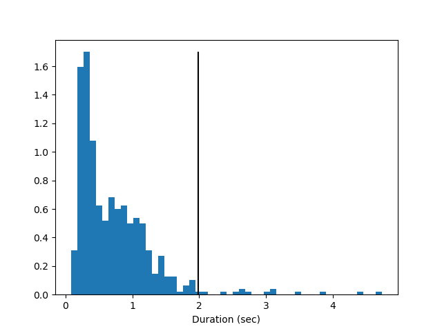
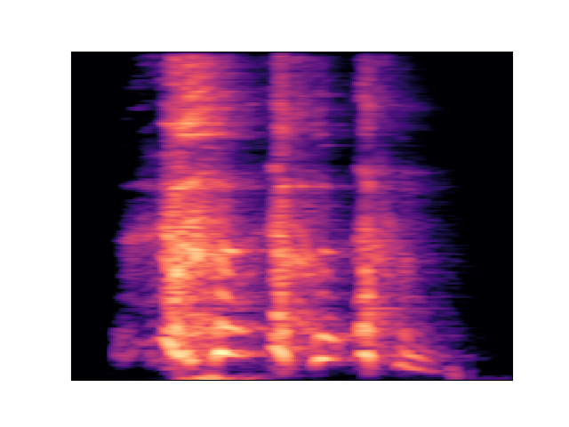

# Vocal Sound Modelling - Cough Detection

In this project, we are tackling the problem of cough detection. This report details the solution and is split into three parts:

1. Data analysis and preprocessing
2. Vocal sound modelling
3. Result and further considerations

## 1. Data analysis and preprocessing

### 1.1 First principles

We have a dataset that represents four vocal sound categorie

- Cough
- Laughter
- Tapping
- Crowd talking

We observe that the audio clips have varying length from a few seconds up to more than two minutes. To prepare the data for modelling purposes, as well as, for the purpose of better capturing temporally local features, we segment the audio clips into **roughly equally sized chunks of preselected duration**, hereafter denoted as  $d$. This serves a dual purpose.

- Our solution resembles a realistic scenario where the classification takes place in **near-real time**, for latency-critical applications.
- We normalize the input data to so that our input samples represent a similar amount of information.
  
An added benefit is that for longer clips, we may generate several samples. For instance, the `Crowd Talking` category contains only five audio clips, with long durations. Segmentation allows to increase the number of samples in this class.

### 1.2 Data Segmentation

We have observed that `cough` audio clips, multiplex cough sounds with silence. However, we know the segments of the clip, containing the sounds (provided in accompanying files called `label.label`). We use these annotated segments of length $$n \triangleq d \times sr$$, where $$d$$ is duration in seconds and $$sr$$ is the sample rate. We have two cases:

- The $k$-th annotated segment duration $d_k$ exceeds the max chunk duration, i.e., $d_k > d$. In this case, we simply keep the first `n` samples, and discard the remaining ones.
- The $k$-th annotated segment duration $d_k$ is less than max chunk duration, i.e., $d_k < d$.. In this case, we pad the segment, on both ends, with zeros (silence). In particular, we add $(d-d_k)/2$ seconds of silence on both ends.

In our experiment, we chose $d=2$ seconds, by inspecting the histogram of `cough` durations, shown below. We find out that approximately $2$ seconds, shown as the black vertical line, correspond to the `97.5-th percentile or all cough duration` and thereby represents the majority of our data distribution. Hence, we chose the chunk duration to be $d=2$ seconds.

For other, non-cough, of the audio clips, we simply segment in chunks of length $d$. We note here that, for long clips, e.g., 120 seconds or longer, we have intentionally chosen to drop every other chunk, as illustrated in the figure below. The reason is to generate samples with smaller correlation, because neighbouring chunks could be highly correlated. Measurement of correlation, is a topic of further research and can be part of the pipeline parametrization process.

!!!!!! FIGURE WITH CHUNKS GOES HERE !!!

## 2. Vocal sound modelling

## 2.1 Preparing data for audio classification

Sounds is a sequential signal, but it can be transformed into an image via the spectrogram, which allows to use computer vision techniques, like Convolutional Neural Networks, which have the added advantage that their implementation can be parallelized. Below, we can see an example spectrogram for coughing

## 2.2 Train-test split

It is a standard practise to split a dataset into two or three parts, namely `train`, `validation` and some times `test`. The most common way of splitting the data is to take to randomly assign samples to train and validation dataset, in a stratified manner to maintain the balance of the classes. However, we claim that this process is not suitable for our dataset.

We have chosen to split the data for train and test by assigning **entire clips in each group**. Hence, all the underlying chunks of the same clip will belong to either the `train` or the `validation` datset. The reason for this is simple; if we randomly split our chunks into train and test after segmentation then we have a risk of data leakage. The reason is the exact same, for which we chose to skip every other chunk as described above.

For instance if we look at the first three cough sounds from `/coughing_batch_2/coughconcat22/data.wav` then we can easily infer that they come from the same person. In case, one or two of these chunks end up in the training data while the remaining in the test set.